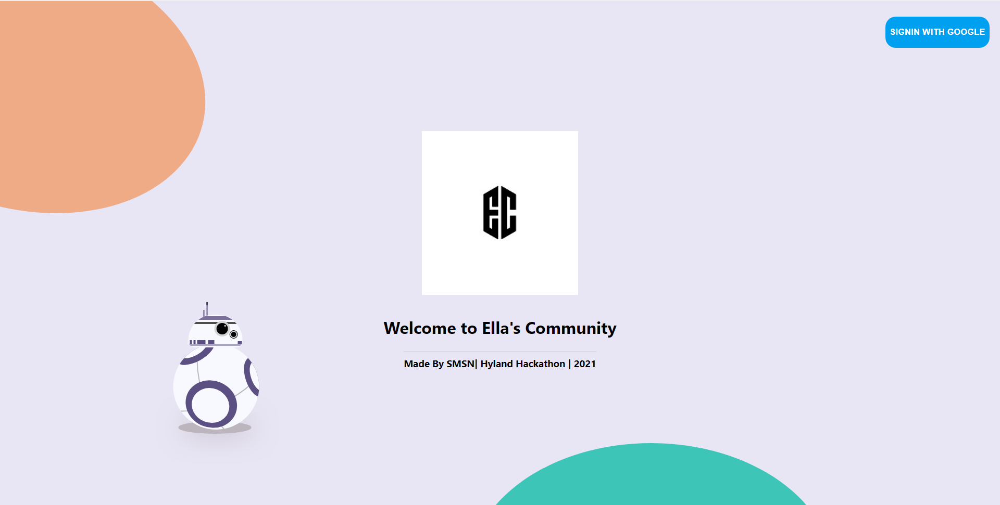
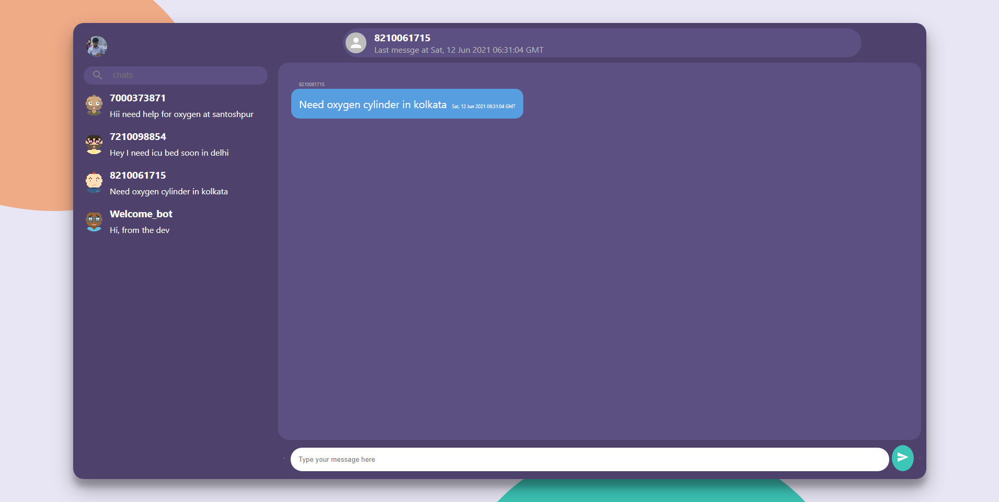

# Ella community web app
- This is recieving end interface of ella healthbot.

## Login page

## Messaging interface


## Tech Stack

- React js
- Firebase Firestore for database
- Firebase Google Authentication
- React Hooks
- React Context API
- React Router
- styled-components
- material-ui icons

## Development

```
$ git clone https://github.com/Nikblaze/EC_interface.git
$ cd whatsapp-web-app
$ npm install && npm start
```
